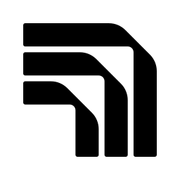

<div align="center">
  <picture align="center">
    <source media="(prefers-color-scheme: dark)" srcset="media/icons/foundry_local_white.svg">
    <source media="(prefers-color-scheme: light)" srcset="media/icons/foundry_local_black.svg">
    
  </picture>
<div id="user-content-toc">
  <ul align="center" style="list-style: none;">
    <summary>
      <h1>Foundry Local</h1><br>
     <h3><a href="https://aka.ms/foundry-local-installer">Download</a> | <a href="https://aka.ms/foundry-local-docs">Documentation</a> | <a href="https://aka.ms/foundry-local-discord">Discord</a></h3>
    </summary>
  </ul>
</div>

## Add on-device AI to your app, effortlessly

</div>


Foundry Local lets you embed generative AI directly into your applications — no cloud or server calls required. All inference runs on-device, which means user data never leaves the device, responses start immediately with zero network latency, and your app works offline. No per-token costs, no backend infrastructure to maintain.

Key benefits include:

- **Self-contained SDK** — Ship AI features without requiring users to install any external dependencies.
- **Easy-to-use CLI** — Explore models and experiment locally before integrating with your app.
- **Optimized models out-of-the-box** — State-of-the-art quantization and compression deliver both performance and quality.
- **Small footprint** — Leverages [ONNX Runtime](https://onnxruntime.ai/); a high performance inference runtime (written in C++) that has minimal disk and memory requirements.
- **Automatic hardware acceleration** — Leverage GPUs and NPUs when available, with seamless fallback to CPU.
- **Model distribution** — Popular open-source models hosted in the cloudwith automatic downloading and updating.
- **Multi-platform support** — Windows, macOS (Apple silicon), Linux and Android.
- **Bring your own models** — Add and run custom models alongside the built-in catalog.

## 🚀 Quickstart

### Explore with the CLI

The Foundry Local CLI is a great way to explore models and test features before integrating with your app.

1. Install the CLI to explore models interactively before integrating with your app.

    **Windows:**
    ```bash
    winget install Microsoft.FoundryLocal
    ```

    **macOS:**
    ```bash
    brew install microsoft/foundrylocal/foundrylocal
    ```

2. Start a chat session with a model:

    ```bash
    foundry model run qwen2.5-0.5b
    ```

3. Explore available models

    ```bash
    foundry model ls
    ```

> [!TIP]
> For installation issues, see the [Installation section](#installing) below.

## Add on-device AI to your app

The Foundry Local SDK makes it easy to integrate local AI models into your applications. Below are quickstart examples for JavaScript, C# and Python.

> [!TIP]
> No CLI or REST calls required at runtime — The JavaScript and C# SDKs are fully self-contained — no CLI installation required for your end users. Currently, the Python SDK has a dependency on the CLI and uses the OpenAI-compatible REST API, but a native in-process SDK is coming soon.

<details open>
<summary><strong>JavaScript</strong></summary>

1. Install the SDK using npm:

    ```bash
    # Windows
    npm install --winml foundry-local-sdk

    # macOS/Linux
    npm install foundry-local-sdk
    ```
    On Windows, we recommend using the `--winml` flag to enable wider hardware acceleration support.

2. Use the SDK in your application as follows:

    ```javascript
    import { FoundryLocalManager } from 'foundry-local-sdk';

    const manager = FoundryLocalManager.create({ appName: 'foundry_local_samples' });

    // Download and load a model (auto-selects best variant for user's hardware)
    const model = await manager.catalog.getModel('qwen2.5-0.5b');
    await model.download();
    await model.load();

    // Create a chat client and get a completion
    const chatClient = model.createChatClient();
    const response = await chatClient.completeChat([
        { role: 'user', content: 'What is the golden ratio?' }
    ]);

    console.log(response.choices[0]?.message?.content);

    // Unload the model when done
    await model.unload();
    ```

</details>

<details>
<summary><strong>C#</strong></summary>

1. Install the SDK using NuGet:

    ```bash
    # Windows 
    dotnet add package Microsoft.AI.Foundry.Local.WinML

    # macOS/Linux
    dotnet add package Microsoft.AI.Foundry.Local
    ```
    On Windows, we recommend using the `Microsoft.AI.Foundry.Local.WinML` package, which will enable wider hardware acceleration support.

2. Use the SDK in your application as follows:
    ```csharp
    using Microsoft.AI.Foundry.Local;

    var config = new Configuration { AppName = "foundry_local_samples" };
    await FoundryLocalManager.CreateAsync(config);
    var mgr = FoundryLocalManager.Instance;

    // Download and load a model (auto-selects best variant for user's hardware)
    var catalog = await mgr.GetCatalogAsync();
    var model = await catalog.GetModelAsync("qwen2.5-0.5b");
    await model.DownloadAsync();
    await model.LoadAsync();

    // Create a chat client and get a streaming completion
    var chatClient = await model.GetChatClientAsync();
    var messages = new List<ChatMessage> 
    { 
        new() { Role = "user", Content = "What is the golden ratio?" } 
    };

    await foreach (var chunk in chatClient.CompleteChatStreamingAsync(messages))
    {
        Console.Write(chunk.Choices[0].Message.Content);
    }

    // Unload the model when done
    await model.Unload();
    ```

</details>

<details>
<summary><strong>Python</strong></summary>

**NOTE:** The Python SDK currently relies on the Foundry Local CLI and uses the OpenAI-compatible REST API. A native in-process SDK (matching JS/C#) is coming soon.

1. Install the SDK using pip:

    ```bash
    pip install foundry-local-sdk openai
    ```

2. Use the SDK in your application as follows:

    ```python
    import openai
    from foundry_local import FoundryLocalManager

    # Initialize manager (starts local service and loads model)
    manager = FoundryLocalManager("phi-3.5-mini")

    # Use the OpenAI SDK pointed at your local endpoint
    client = openai.OpenAI(base_url=manager.endpoint, api_key=manager.api_key)

    response = client.chat.completions.create(
        model=manager.get_model_info("phi-3.5-mini").id,
        messages=[{"role": "user", "content": "What is the golden ratio?"}]
    )

    print(response.choices[0].message.content)
    ```

</details>

### More samples

Explore complete working examples in the [`samples/`](samples/) folder:

| Sample | Description |
|--------|-------------|
| [**cs/**](samples/cs/) | C# examples using the .NET SDK |
| [**js/**](samples/js/) | JavaScript/Node.js examples |
| [**python/**](samples/python/) | Python examples using the OpenAI-compatible API |

## Manage

This section provides an overview of how to manage Foundry Local, including installation, upgrading, and removing the application.

### Installing

Foundry Local is available for Windows and macOS (Apple silicon only). You can install it using package managers or manually download the installer.

#### Windows

You can install Foundry Local using the following command in a Windows console (PowerShell, cmd, etc.):

```bash
winget install Microsoft.FoundryLocal
```

Alternatively, you can also manually download and install the packages. On [the releases page](https://github.com/microsoft/Foundry-Local/releases)
select a release and expand the Artifacts list. Copy the artifact full URI (for example: `https://github.com/microsoft/Foundry-Local/releases/download/v0.3.9267/FoundryLocal-x64-0.3.9267.43123.msix`)
to use in the below PowerShell steps. Replace `x64` with `arm64` as needed.

```powershell
# Download the package and its dependency
$releaseUri = "https://github.com/microsoft/Foundry-Local/releases/download/v0.3.9267/FoundryLocal-x64-0.3.9267.43123.msix"
Invoke-WebRequest -Method Get -Uri $releaseUri -OutFile .\FoundryLocal.msix
$crtUri = "https://aka.ms/Microsoft.VCLibs.x64.14.00.Desktop.appx"
Invoke-WebRequest -Method Get -Uri $crtUri -OutFile .\VcLibs.appx

# Install the Foundry Local package
Add-AppxPackage .\FoundryLocal.msix -DependencyPath .\VcLibs.appx
```

If you're having problems installing Foundry, please [file an issue](https://github.com/microsoft/foundry-local/issues)
and include logs using one of these methods:

- For WinGet - use `winget install Microsoft.FoundryLocal --logs --verbose` - select the most-recently-dated log file
  and attach it to the issue.
- For `Add-AppxPackage` - immediately after it indicates an error, in an elevated PowerShell instance, use
  `Get-MsixLogs | Out-File MsixLogs.txt` and attach it to the issue.
- Use [Windows Feedback Hub](feedback-hub:) and create a Problem in the "Apps > All other apps" category. Use the
  "Add More Details > Recreate my problem" and re-run the failing commands to collect more data. Once your feedback
  is submitted, use the "Share" option to generate a link and put that into the filed issue.

> [!NOTE]
> Log files may contain information like user names, IP addresses, file paths, etc. Be sure to remove those
> before sharing here.

#### macOS

Install Foundry Local using the following command in your terminal:

```bash
brew install microsoft/foundrylocal/foundrylocal
```

Alternatively, you can also manually download and install the packages by following these steps:

1. Download the latest release from [the releases page](https://github.com/microsoft/Foundry-Local/releases).
1. Unzip the downloaded file.
1. Open a terminal and navigate to the unzipped folder, run the following command to install Foundry Local:

   ```bash
   ./install-foundry.command
   ```

### Upgrading

To upgrade Foundry Local, run the following command in your terminal:

- **Windows**

  ```bash
  winget upgrade --id Microsoft.FoundryLocal
  ```

- **macOS**:
  If you installed Foundry Local using Homebrew, you can upgrade it with the following command:
  ```
  brew upgrade foundrylocal
  ```
  If you installed Foundry Local manually, you'll first need to uninstall the current version using:
  ```bash
  uninstall-foundry
  ```
  Then, follow the [installation instructions](#installing) to install the latest version.

### Uninstalling

To uninstall Foundry Local, run the following command in your terminal:

- **Windows**: You can uninstall Foundry Local using `winget` in a Windows console (PowerShell, cmd, etc.):

  ```bash
  winget uninstall Microsoft.FoundryLocal
  ```

  Alternatively, you can also uninstall Foundry Local by navigating to **Settings > Apps > Apps & features** in Windows, finding "Foundry Local" in the list, and selecting the ellipsis (`...`) followed by **Uninstall**.

- **macOS**: If you installed Foundry Local using Homebrew, you can uninstall it with the following command:
  ```bash
  brew rm foundrylocal
  brew untap microsoft/foundrylocal
  brew cleanup --scrub
  ```
  If you installed Foundry Local manually, you can uninstall it by running the following command in your terminal:
  ```bash
  uninstall-foundry
  ```

## Reporting Issues

We're actively looking for feedback during this preview phase. Please report issues or suggest improvements in the [GitHub Issues](https://github.com/microsoft/Foundry-Local/issues) section.

## 🎓 Learn More

- [Foundry Local Documentation on Microsoft Learn](https://learn.microsoft.com/en-us/azure/ai-foundry/foundry-local/?view=foundry-classic)
- [Troubleshooting guide](https://learn.microsoft.com/azure/ai-foundry/foundry-local/reference/reference-best-practice?view=foundry-classic)

## ⚖️ License

Foundry Local is licensed under the Microsoft Software License Terms. For more details, read the [LICENSE](LICENSE) file.
