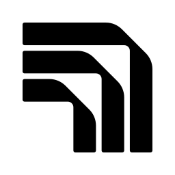

<div align="center">
  <picture align="center">
    <source media="(prefers-color-scheme: dark)" srcset="media/icons/foundry_local_white.svg">
    <source media="(prefers-color-scheme: light)" srcset="media/icons/foundry_local_black.svg">
    
  </picture>
<div id="user-content-toc">
  <ul align="center" style="list-style: none;">
    <summary>
      <h1>Foundry Local</h1><br>
     <h3><a href="https://aka.ms/foundry-local-installer">Download</a> | <a href="https://aka.ms/foundry-local-docs">Documentation</a> | <a href="https://aka.ms/foundry-local-discord">Discord</a></h3>
    </summary>
  </ul>
</div>

## Ship on-device AI inside your app

</div>

Foundry Local is an **end-to-end local AI solution** for building applications that run entirely on the user's device. It provides native SDKs (C#, JavaScript, Python, and Rust), a curated catalog of optimized models, and automatic hardware acceleration — all in a lightweight package (~20 MB).

User data never leaves the device, responses start immediately with zero network latency, and your app works offline. No per-token costs, no API keys, no backend infrastructure to maintain, and no Azure subscription required.

### Key Features

- **Lightweight runtime** — The runtime handles model acquisition, hardware acceleration, model management, and inference (via [ONNX Runtime](https://onnxruntime.ai/)). The runtime adds approximately 20 MB to your application package, making it practical to embed AI directly into applications where size matters.

- **Curated model catalog** — A catalog of high-quality models optimized for on-device use across a wide range of consumer hardware. The catalog covers chat completions (for example, GPT OSS, Qwen, DeepSeek, Mistral and Phi) and audio transcription (for example, Whisper). Every model goes through extensive quantization and compression to deliver the best balance of quality and performance. Models are versioned, so your application can pin to a specific version or automatically receive updates.

- **Automatic hardware acceleration** — Foundry Local detects the available hardware on the user's device and selects the best execution provider. It accelerates inference on GPUs and NPUs when available and falls back to CPU seamlessly — no hardware detection code required. Execution provider and driver updates are managed automatically to ensure optimal performance across different hardware configurations.

- **Smart model management** — Foundry Local handles the full lifecycle of models on end-user devices. Models download automatically on first use, are cached locally for instant subsequent launches, and the best-performing variant is selected for the user's specific hardware.

- **OpenAI-compatible API** — Supports OpenAI request and response formats including the [OpenAI Responses API format](https://developers.openai.com/api/reference/resources/responses). If your application already uses the OpenAI SDK, point it to a Foundry Local endpoint with minimal code changes.

- **Optional local server** — An OpenAI-compatible web server for serving models to multiple processes, integrating with tools like LangChain, or experimenting through REST calls. For most embedded application scenarios, use the SDK directly — it runs inference in-process without the overhead of a separate server.


## 🚀 Quickstart

> [!TIP]
> The following shows a quickstart for Python and JavaScript. C# and Rust language bindings are also available. Take a look at the [samples](/samples/) for more details.


<details open>
<summary><strong>JavaScript</strong></summary>

1. Install the SDK:

    ```bash
    # Windows (recommended for hardware acceleration)
    npm install foundry-local-sdk-winml
    
    # macOS/linux
    npm install foundry-local-sdk
    ```

2. Run your first chat completion:

    ```javascript
    import { FoundryLocalManager } from 'foundry-local-sdk';

    const manager = FoundryLocalManager.create({ appName: 'my-app' });

    // Download and load a model (auto-selects best variant for user's hardware)
    const model = await manager.catalog.getModel('qwen2.5-0.5b');
    await model.download((progress) => {
        process.stdout.write(`\rDownloading... ${progress.toFixed(2)}%`);
    });
    await model.load();

    // Create a chat client and get a completion
    const chatClient = model.createChatClient();
    const response = await chatClient.completeChat([
        { role: 'user', content: 'What is the golden ratio?' }
    ]);

    console.log(response.choices[0]?.message?.content);

    // Unload the model when done
    await model.unload();
    ```

</details>


<details open>
<summary><strong>Python</strong></summary>

1. Install the SDK:

    ```bash
    # Windows (recommended for hardware acceleration)
    pip install foundry-local-sdk-winml

    # macOS/Linux
    pip install foundry-local-sdk
    ```

2. Run your first chat completion:

    ```python
    from foundry_local_sdk import Configuration, FoundryLocalManager

    config = Configuration(app_name="foundry_local_samples")
    FoundryLocalManager.initialize(config)
    manager = FoundryLocalManager.instance

    # Select and load a model from the catalog
    model = manager.catalog.get_model("qwen2.5-0.5b")
    model.download()
    model.load()

    # Get a chat client
    client = model.get_chat_client()

    # Create and send message
    messages = [
        {"role": "user", "content": "What is the golden ratio?"}
    ]
    response = client.complete_chat(messages):
    print(f"Response: {response.choices[0].message.content}")
   
    model.unload()
    ```

</details>


### 💬 Audio Transcription (Speech-to-Text)

The SDK also supports audio transcription via Whisper models (available in JavaScript, C#, Python and Rust):

```javascript
import { FoundryLocalManager } from 'foundry-local-sdk';

const manager = FoundryLocalManager.create({ appName: 'my-app' });

const whisperModel = await manager.catalog.getModel('whisper-tiny');
await whisperModel.download();
await whisperModel.load();

const audioClient = whisperModel.createAudioClient();
audioClient.settings.language = 'en';

// Transcribe an audio file
const result = await audioClient.transcribe('recording.wav');
console.log('Transcription:', result.text);

// Or stream in real-time
for await (const chunk of audioClient.transcribeStreaming('recording.wav')) {
    process.stdout.write(chunk.text);
}

await whisperModel.unload();
```

> [!TIP]
> A single `FoundryLocalManager` can manage both chat and audio models simultaneously. See the [chat-and-audio sample](samples/js/chat-and-audio-foundry-local/) for a complete example.

## 📦 Samples

Explore complete working examples in the [`samples/`](samples/) folder:

| Language | Samples | Highlights |
|----------|---------|------------|
| [**C#**](samples/cs/) | 12 | Native chat, audio transcription, tool calling, model management, web server, tutorials |
| [**JavaScript**](samples/js/) | 12 | Native chat, audio, Electron app, Copilot SDK, LangChain, tool calling, tutorials |
| [**Python**](samples/python/) | 9 | Chat completions, audio transcription, LangChain, tool calling, tutorials |
| [**Rust**](samples/rust/) | 8 | Native chat, audio transcription, tool calling, web server, tutorials |

## 🖥️ CLI

The Foundry Local CLI lets you explore models and experiment interactively.

**Install:**

```bash
# Windows
winget install Microsoft.FoundryLocal

# macOS
brew install microsoft/foundrylocal/foundrylocal
```

**Run a model:**

```bash
foundry model run qwen2.5-0.5b
```

**List available models:**

```bash
foundry model ls
```

> For the full CLI reference and advanced usage, see the [CLI documentation on Microsoft Learn](https://learn.microsoft.com/en-us/azure/foundry-local/reference/reference-cli).


## Reporting Issues

Please report issues or suggest improvements in the [GitHub Issues](https://github.com/microsoft/Foundry-Local/issues) section.

## 🎓 Learn More

- [Foundry Local Documentation](https://learn.microsoft.com/en-us/azure/foundry-local/) on Microsoft Learn
- [Foundry Local Lab](https://github.com/Microsoft-foundry/foundry-local-lab) — Hands-on exercises and step-by-step instructions

## ❔ Frequently asked questions

### Is Foundry Local a web server and CLI tool?

No. Foundry Local is an **end-to-end local AI solution** that your application ships with. It handles model acquisition, hardware acceleration, and inference inside your app process through the SDK. The optional web server and CLI are available for development workflows, but the core product is the local AI runtime and SDK that you integrate directly into your application.

### Why doesn't Foundry Local support every available model?

Foundry Local is designed for shipping production applications, not for general-purpose model experimentation. The model catalog is intentionally curated to include models that are optimized for specific application scenarios, tested across a range of consumer hardware, and small enough to distribute to end users. This approach ensures that every model in the catalog delivers reliable performance when embedded in your application — rather than offering a broad selection of models with unpredictable on-device behavior.

### Can Foundry Local run on a server?

Foundry Local is optimized for hardware-constrained devices where a single user accesses the model at a time. While you can technically install and run it on server hardware, it isn't designed as a server inference stack.

Server-oriented runtimes like [vLLM](https://docs.vllm.ai/en/latest/) or [Triton Inference Server](https://github.com/triton-inference-server/server) are built for multi-user scenarios — they handle concurrent request queuing, continuous batching, and efficient GPU sharing across many simultaneous clients. Foundry Local doesn't provide these capabilities. Instead, it focuses on lightweight, single-user inference with automatic hardware detection, KV-cache management, and model lifecycle handling that make sense for client applications.

If you need to serve models to multiple concurrent users, use a dedicated server inference framework. Use Foundry Local when the model runs on the end user's own device.


### What platforms are supported?

Foundry Local supports Windows, macOS (Apple silicon), and Linux.


## ⚖️ License

Foundry Local is licensed under the Microsoft Software License Terms. For more details, read the [LICENSE](LICENSE) file.
